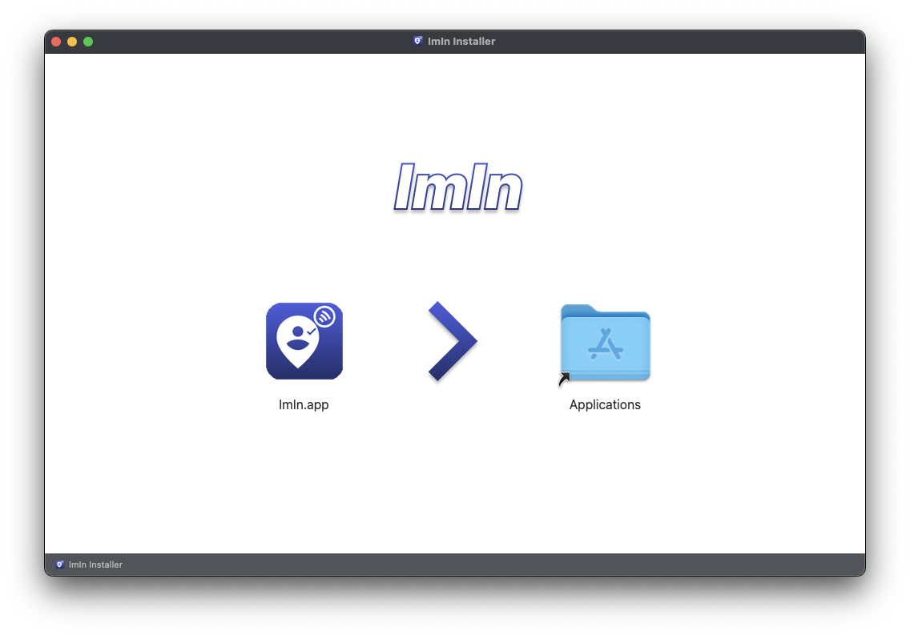
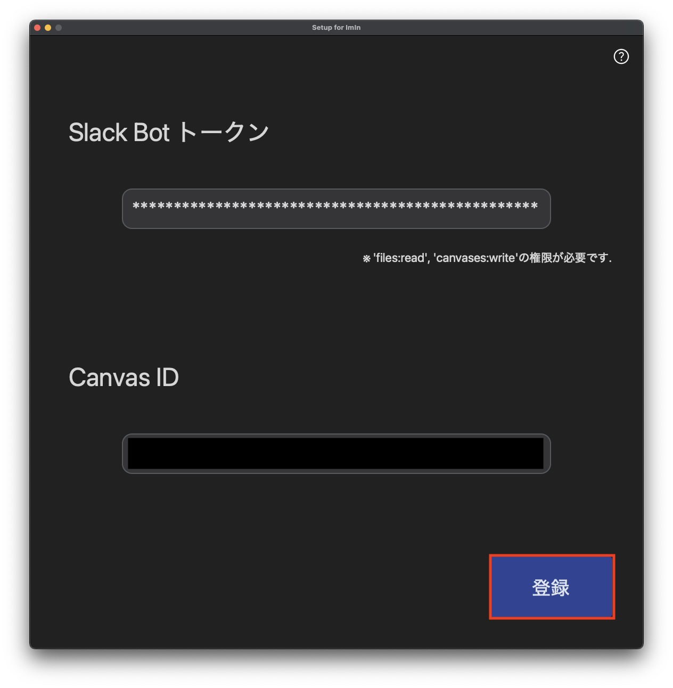
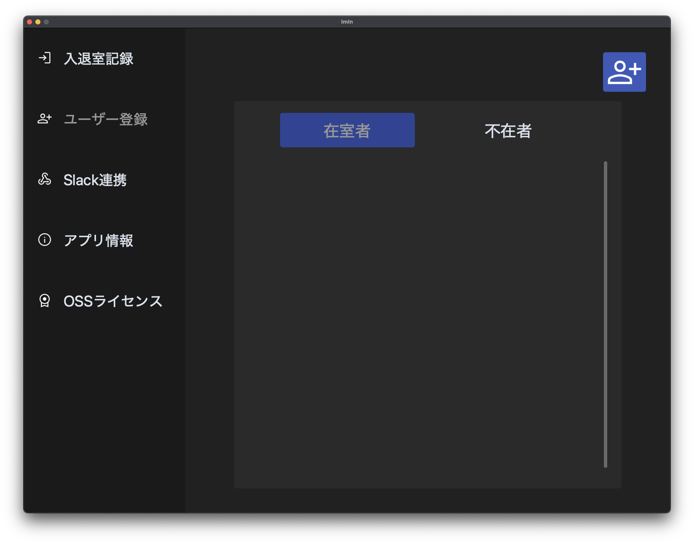
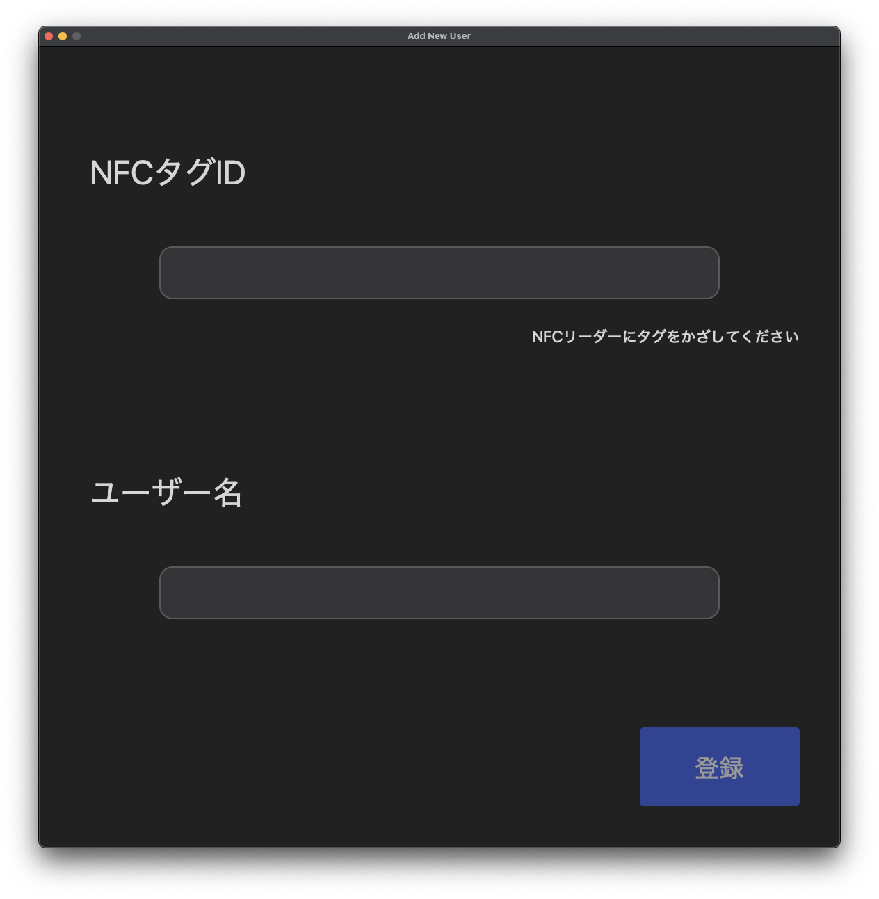
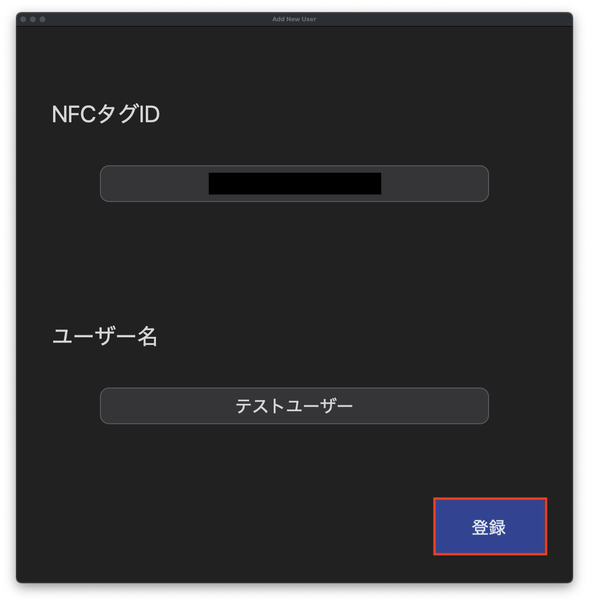
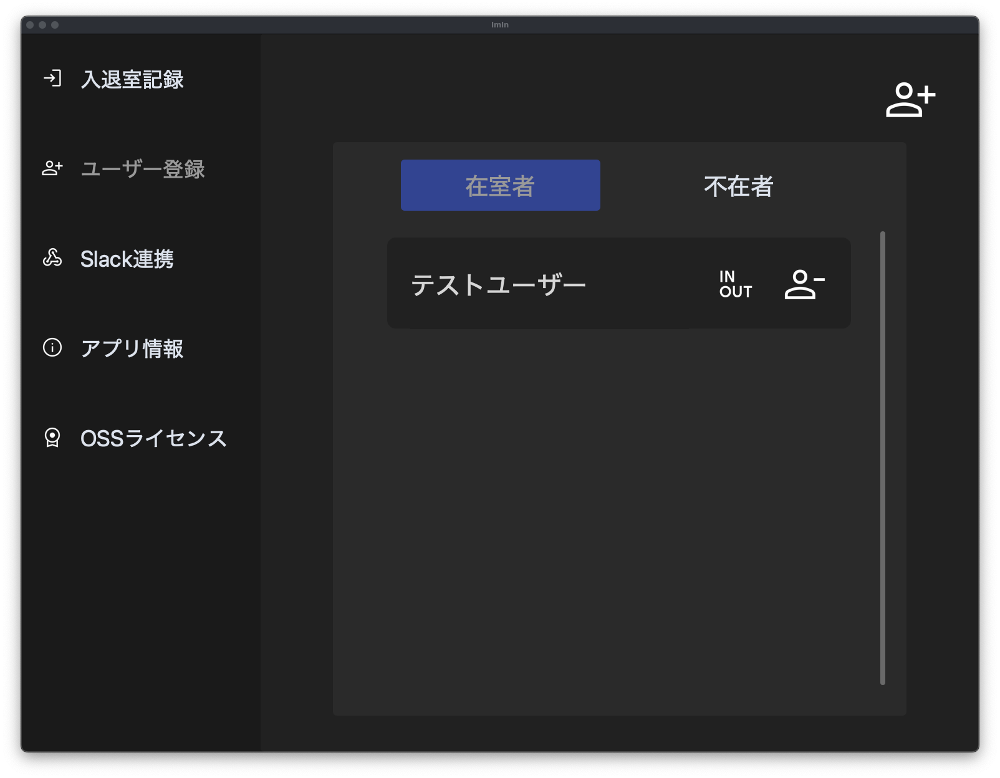
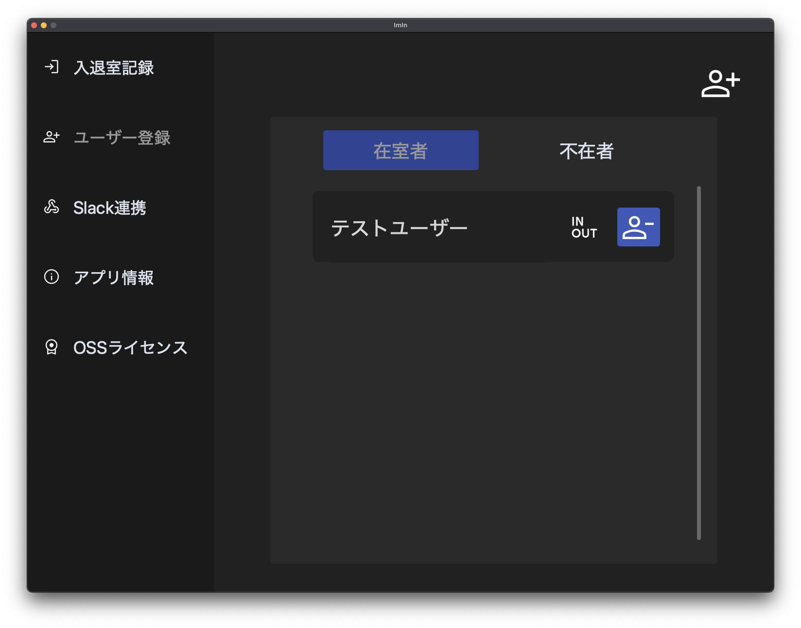
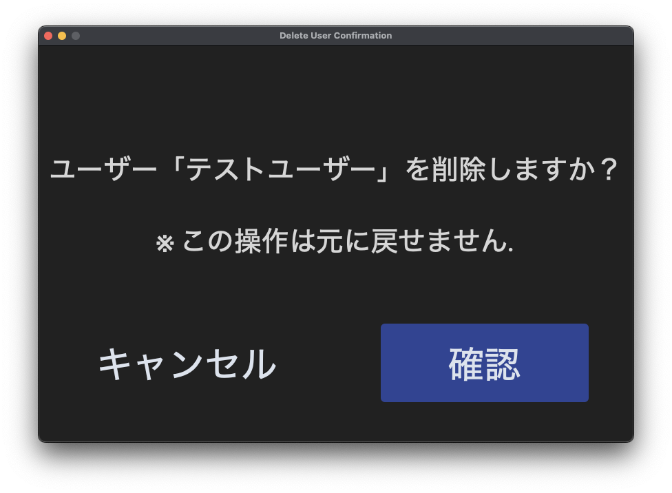
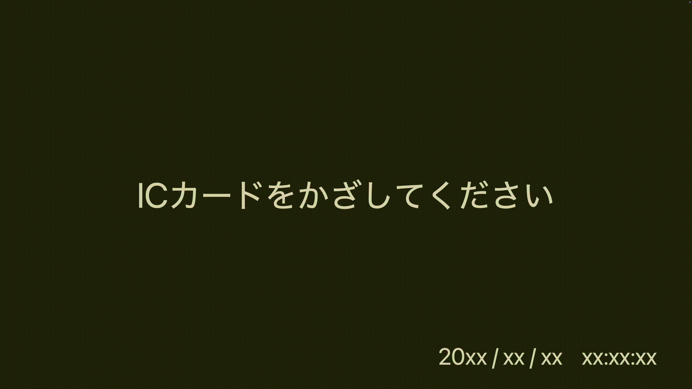
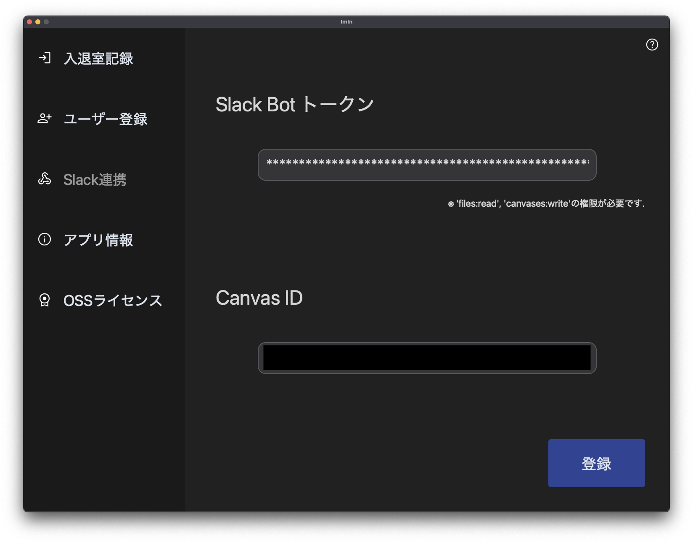

# ImIn <!-- omit in toc -->

  

## 概要 <!-- omit in toc -->

`ImIn`は, 在室状況をSlack上で共有するためのデスクトップアプリケーションです.
ユーザーはアプリケーションを通じて, NFCタグを用いて自身の在室状況を簡単に更新でき, その情報は指定したSlackキャンバスにリアルタイムで反映されます.
これにより, チームメンバーは互いの在室状況を即座に把握でき, 効率的なコミュニケーションが可能になります.

## 目次 <!-- omit in toc -->
- [インストール](#インストール)
  - [macOSの場合](#macosの場合)
  - [インストーラーの実行](#インストーラーの実行)
- [使い方](#使い方)
  - [Slack連携 (初回起動時)](#slack連携-初回起動時)
  - [ユーザー登録](#ユーザー登録)
    - [ユーザー追加](#ユーザー追加)
    - [ユーザー削除](#ユーザー削除)
  - [入退室記録](#入退室記録)
    - [NFCタグを用いた入退室](#nfcタグを用いた入退室)
    - [手動による入退室](#手動による入退室)
  - [Slack連携 (設定変更時)](#slack連携-設定変更時)
- [ライセンス](#ライセンス)
- [OSSライセンス](#ossライセンス)
- [お問い合わせ先](#お問い合わせ先)

## インストール

### macOSの場合

はじめに, お使いのMacのチップに応じて, 以下のリンクから最新のインストーラーをダウンロードしてください.

> [!TIP]
> Macのチップの確認方法については, [こちら](https://support.apple.com/ja-jp/HT211814)をご覧ください.
> `このMacについて`の`概要`タブで, `プロセッサ`または`チップ`の項目を確認します.
> `Intel`と表示されている場合はIntelプロセッサ, `Apple M1`や`Apple M2`などと表示されている場合はAppleシリコンチップです.

### インストーラーの実行

お使いのMacに応じたインストーラーを以下のリンクからダウンロードしてください.
- [ImIn Installer for macOS (Intel)](https://github.com/fumito100111/ImIn/releases/latest/download/ImIn_v0.1.0_macos_x86_64_Installer.dmg)
- [ImIn Installer for macOS (Apple Silicon)](https://github.com/fumito100111/ImIn/releases/latest/download/ImIn_v0.1.0_macos_arm64_Installer.dmg)

> [!TIP]
> デフォルトの設定では, ダウンロードフォルダにダウンロードされます.

ダウンロードしたインストーラー(.dmg)をダブルクリックすると, 以下のようなウィンドウが表示されます.

  

左の`ImIn`アイコンを右の`アプリケーション`フォルダにドラッグ&ドロップすると, アプリケーションがインストールされます.
起動するには, `Launchpad`や`アプリケーション`フォルダから`ImIn`を探してクリックします.

## 使い方

### Slack連携 (初回起動時)

初回起動時にSlackとの連携設定を行います.
初回起動時には, 以下のようなSlack連携設定画面が表示されます.

  

`Slack Bot トークン`の欄には, SlackアプリのOAuthトークンを入力します.
`Canvas ID`の欄には, 在室状況を表示するSlackキャンバスのIDを入力します.
`Slack Bot トークン`と`Canvas ID`の取得方法については, [こちら](./docs/SLACK_SETUP.md)をご覧ください.

  

最後に, `登録`ボタンを押すとSlack連携の設定が完了します.

### ユーザー登録
#### ユーザー追加

ユーザーの新規登録はNFCタグを用いて行います.
そのため, NFCリーダーが接続されている必要があります.

はじめに, 左のサイドバーから`ユーザー登録`を選択します.
次に, 右上のユーザー追加アイコンをクリックします.

  

すると, 以下のようなユーザー追加画面が表示されます.
> [!IMPORTANT]
> このとき, NFCリーダーが正しく接続されていない場合は接続待機画面が表示されます.

  

ユーザー追加画面が表示されたら, 登録するNFCタグをNFCリーダーにかざして, ユーザー名を入力します.

  

最後に, `登録`ボタンを押すとユーザーの新規登録が完了します.
正しく登録が完了すると, 以下のように`ユーザー登録`画面の`在室者`リストに新規ユーザーが追加されます.

> [!TIP]
> このとき, すでに登録済みのNFCタグを使用した場合はエラーメッセージが表示されます.

  

#### ユーザー削除

はじめに, 左のサイドバーから`ユーザー登録`を選択します.
次に, `在室者` or `不在者`リストから削除したいユーザーを探して, 右側のユーザー削除アイコンをクリックします.

  

すると, 以下のようなユーザー削除の確認画面が表示されます.
`確認`ボタンを押すとユーザーの削除が完了します.
> [!IMPORTANT]
> この操作は取り消せないので, 削除するユーザーの情報をよく確認してください.

  

### 入退室記録

あらかじめNFCタグを用いてユーザー登録を行う必要があります.
在室状況はSlackキャンバスにリアルタイムで反映されます.

> [!TIP]
> 在室状況がSlackキャンバスに反映されるまでには数秒かかる場合があります.

#### NFCタグを用いた入退室

はじめに, 左のサイドバーから`入退室記録`を選択します.
`ユーザー登録`や`Slack連携`などの設定が必要な場合以外は, 以下のような`入退室記録`画面が表示されていることが想定されます.

> [!IMPORTANT]
> このとき, NFCリーダーが正しく接続されていない場合は接続待機画面が表示されます.

> [!TIP]
> `入退室記録`画面は全画面表示となっています. ウィンドウを閉じると, アプリケーションのメイン画面に戻ります.

  

実際にNFCタグをNFCリーダーにかざすと, 以下のように在室状況が更新されます.

  

> [!TIP]
> NFCタグをかざした際に, 登録されていないNFCタグの場合は`登録されていません`と表示されます.

#### 手動による入退室

NFCタグを用いずに手動で入退室の記録を行うことも可能です.
はじめに, 左のサイドバーから`ユーザー登録`を選択します.
次に, `在室者` or `不在者`リストから入退室を記録したいユーザーを探して, 右側のIn/Outアイコンをクリックします.
すると, 以下のようにユーザーの在室状況が更新されます.

  

### Slack連携 (設定変更時)

はじめに, 左のサイドバーから`Slack連携`を選択します.
次に, `Slack Bot トークン`と`Canvas ID`の欄に新しい情報を入力します.
`Slack Bot トークン`と`Canvas ID`の取得方法については, Slack連携 (初回起動時)と同様に[こちら](./docs/SLACK_SETUP.md)をご覧ください.

  

最後に, `登録`ボタンを押すとSlack連携の設定変更が完了します.

> [!TIP]
> 新しい登録に成功した場合, `トークンが正常に登録されました`というメッセージが表示されます.

## ライセンス

このアプリケーションはMITライセンスの下で提供されています. 詳細は[LICENSE](LICENSE)ファイルを参照してください.

## OSSライセンス

本アプリケーションは以下のオープンソースソフトウェアを利用しています:
- [Bolt for Python](https://github.com/slackapi/bolt-python) [[MIT](./app/assets/licenses/LICENSE_Bolt-for-Python)]
- [create-dmg](https://github.com/create-dmg/create-dmg) [[MIT](./app/assets/licenses/LICENSE_create--dmg)]
- [CustomTkinter](https://github.com/TomSchimansky/CustomTkinter) [[MIT](./app/assets/licenses/LICENSE_CustomTkinter)]
- [Darkdetect](https://github.com/albertosottile/darkdetect) [[BSD 3-Clause](./app/assets/licenses/LICENSE_Darkdetect)]
- [Google Material Symbols and Icons](https://github.com/google/material-design-icons) [[Apache 2.0](./app/assets/licenses/LICENSE_Google-Material-Symbols-and-Icons)]
- [jaraco.classes](https://github.com/jaraco/jaraco.classes) [[MIT](./app/assets/licenses/LICENSE_jaraco.classes)]
- [jaraco.context](https://github.com/jaraco/jaraco.context) [[MIT](./app/assets/licenses/LICENSE_jaraco.context)]
- [jaraco.functools](https://github.com/jaraco/jaraco.functools) [[MIT](./app/assets/licenses/LICENSE_jaraco.functools)]
- [keyring](https://github.com/jaraco/keyring) [[MIT](./app/assets/licenses/LICENSE_keyring)]
- [More Itertools](https://github.com/more-itertools/more-itertools) [[MIT](./app/assets/licenses/LICENSE_More-Itertools)]
- [Nuitka](https://github.com/Nuitka/Nuitka) [[Apache 2.0](./app/assets/licenses/LICENSE_Nuitka)]
- [Ordered Set](https://github.com/simonpercivall/orderedset) [[MIT](./app/assets/licenses/LICENSE_Ordered-Set)]
- [packaging](https://github.com/pypa/packaging) [[Apache 2.0](./app/assets/licenses/LICENSE_packaging)]
- [Pillow](https://github.com/python-pillow/Pillow) [[MIT-CMU](./app/assets/licenses/LICENSE_Pillow)]
- [pyscard](https://github.com/LudovicRousseau/pyscard) [[LGPL-2.1](./app/assets/licenses/LICENSE_pyscard)]
- [Python](https://www.python.org/) [[PSF Version.2](./app/assets/licenses/LICENSE_Python)]
- [python-certifi](https://github.com/certifi/python-certifi) [[MPL-2.0](./app/assets/licenses/LICENSE_python--certifi)]
- [python-zstandard](https://github.com/indygreg/python-zstandard) [[BSD 3-Clause](./app/assets/licenses/LICENSE_python--zstandard)]
- [Python Slack SDK](https://github.com/slackapi/python-slack-sdk) [[MIT](./app/assets/licenses/LICENSE_Python-Slack-SDK)]

## お問い合わせ先

- **開発者**: [fumito100111](https://github.com/fumito100111)
- **Email**: [imin.app.developer@gmail.com](mailto:imin.app.developer@gmail.com)